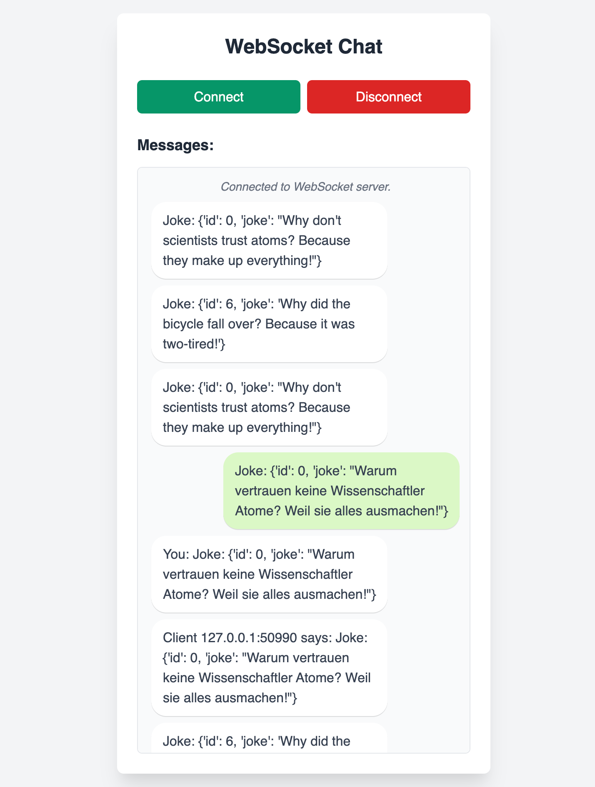
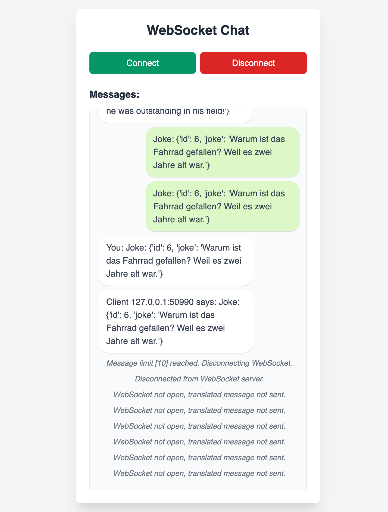

# ws-chat-py

## Project setup

```sh
#clone the repository
git clone https://github.com/avimehenwal/ws-chat-py.git

# Create a python virtual environemnt
python3 -m venv .venv
source .venv/bin/activate

# Install requirements
pip install -r requirements.txt

# Run docker-compose to start backend service
docker compose up -d

# Start backend
fastapi run main.py
```

Considering all above steps succeed, application would be available at http://localhost:8000/

- API Documentation - http://localhost:8000/docs http://localhost:8000/redoc
- Analytics - http://localhost:8000/chat/analytics

## Tech stack used

Only free & opensourced libraries were uses for this application version

### Dependencies

| S.No | dependency                    | purpose                  |
| ---- | ----------------------------- | ------------------------ |
| 1.   | libretranslate/libretranslate | translations             |
| 2.   | redis                         | analytics and data-store |

Generating API keys with `libretranslate` was not possible without purchasing their plan so chose a self-hosted version

## Code Organization

Source code is organized as per following modules which could be easily extended, replaced in future

### Modules

1. Health check API
2. Jokes API
3. Chat API
4. www - for frontend assets

```sh
./
├── README.md
├── chat
│   ├── connection_manager.py
│   └── routes.py
├── docker-compose.yml
├── health
│   └── routes.py
├── joke
│   ├── data.py
│   └── routes.py
├── main.py
├── requirements.txt
└── www
    ├── routes.py
    ├── static
    │   └── script.js
    └── templates
        └── index.html
```

## demo






## Further Improvements

1. Jokes could come from data-source like a postgres database or external API
2. Once data source is added, service-repository pattern could be used to organize code
3. Use Environment variables for service URLs like database connection string, redis_url etc which depende on environment